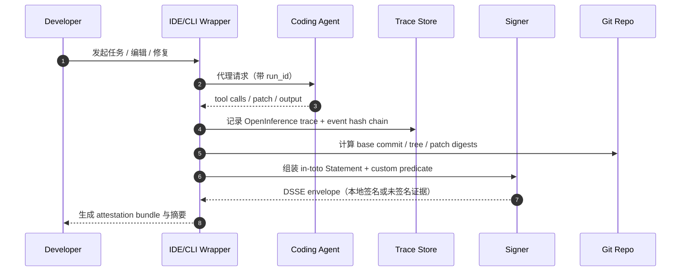
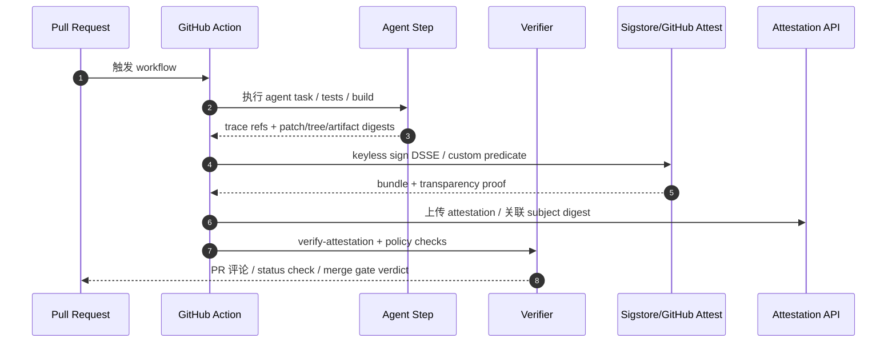
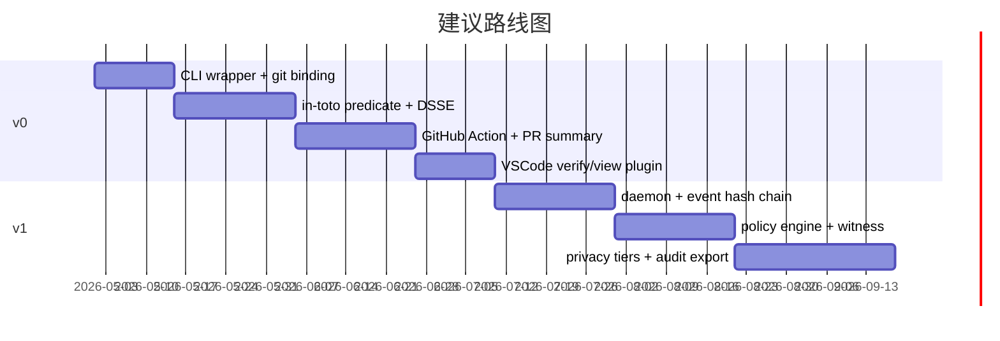

# 面向 AI 编程代理的 Agent Provenance 与 Attestation 研究报告

> **2026-09 addendum.** This report's core recommendation — a **thin composition layer** over in-toto / DSSE / Sigstore / OpenTelemetry rather than a new底层标准 — has held up and is **preserved**. Five months on, the harness plane has consolidated: `AGENTS.md` is now a cross-vendor operating contract, MCP is the standard tool/data plane (Linux Foundation agentic-AI governance), OpenTelemetry GenAI conventions and harness-native telemetry are stable, and first-party platform coding agents (e.g. GitHub Copilot coding agent) author PRs directly. The predicate model was extended to **v1** (`https://agentattest.dev/predicate/v1`) to bind these — `agentConfig`, `mcpServers`/`tools`, `delegation`, `capture`, and `platform-agent` identities — while v0 stays byte-for-byte stable. See [`docs/FRONTIER_HARNESS_2026.md`](docs/FRONTIER_HARNESS_2026.md) for the full landscape review and gap analysis. The original April-2026 analysis follows unchanged for historical context.

## 执行摘要

结论先行：**不要再发明一套新的“底层标准”**。这个方向最稳妥的产品形态，不是新的签名系统、不是新的 trace 协议、也不是新的 SBOM 格式，而是一个**薄而硬的组合层**：外层用 **in-toto Statement v1 + DSSE** 表达“这份声明到底在说哪个产物、说了什么”；供应链/构建侧借用 **SLSA provenance** 的术语与资源描述；运行时证据层用 **OpenTelemetry/OpenInference** 记录 agent、tool、retrieval、子代理与输入输出；签名与透明日志用 **Sigstore/cosign + Fulcio + Rekor**；分发与开发者工作流优先复用 **entity["company","GitHub","developer platform"] artifact attestations / actions/attest / gh attestation**；组件清单与漏洞状态则外挂 **SPDX / CycloneDX / OpenVEX**。这条路线几乎把现成轮子全用上了，真正需要你做的是一个**“Agent Provenance Profile”**：把 agent 运行证据、git diff/tree、CI 身份、PR 语义、人类批准和隐私策略，统一绑定成一个可验证声明。citeturn15view0turn16view0turn0search2turn17search7turn17search0turn19view0

这个赛道的真实空白，不在“再做一个 Langfuse/Phoenix/MLflow 式观察面板”，也不在“再做一个 SLSA/Sigstore 式底层签名项目”。现有工具已经很好地覆盖了**运行可观测性**、**构建 provenance**、**SBOM/VEX**、**透明日志**与**GitHub 内分发**，但它们之间普遍缺一层：**把 agent 运行过程与最终 git 变更/PR/发布产物进行一一绑定**，并把这种绑定升级成**可验证、可审计、可重放、可执行合规策略**的声明。也就是说，市场缺的是“**agent 证据编排层**”，不是“又一个基础设施孤岛”。citeturn18search0turn18search1turn18search7turn1search4turn26search3

从强度上看，这个方向应当一开始就明确分层：**本地桌面**最多做到“evidence-grade（证据级）”——能证明“某次 agent run 与某个 diff/patch/tree 的关系”，但很难证明机器本身未被篡改；**CI/GitHub Action** 可以做到“policy-grade（策略级）”——因为可复用 OIDC、短证书、透明日志与受保护分支；**隔离运行器 + witness + 强制 merge gate** 才可能接近“high-assurance（高保证）”。因此产品路线应当是：**GitHub-first、CI-first 提供硬保证；本地 CLI / VSCode 插件提供软证据与良好 UX**。citeturn17search1turn17search5turn17search3turn1search3turn22view2turn20search2

## Hugging Face 侧优先检查清单

按你的要求，研究首先从 Hugging Face 侧展开；我优先检查的是**两类资源**：一类是**模型/文件 metadata 先例**，另一类是**agent 实证数据与研究**。前者说明哪些字段与文件格式适合复用，后者说明为什么这个方向值得做。具体优先对象如下。citeturn7search0turn7search1turn8search3turn13view0turn13view2turn14view0

- **Hub Model Cards / README YAML metadata**：适合作为 `model_ref`、`license`、`base_model`、`datasets`、`new_version` 等轻量模型身份与来源字段的先例。citeturn7search0  
- **Safetensors metadata**：说明可以在**不下载整份权重**的情况下解析 metadata，适合做模型指纹与证据补充。citeturn7search1  
- **GGUF 与其 metadata 生态**：HF 文档与 GGUF 规范都表明，GGUF 的单文件与可扩展 key-value metadata 思路很适合借鉴到“模型执行环境指纹”字段中。citeturn8search3turn29view0  
- **AIDev**：给了大规模 agent-authored PR 语料，是最直接的“这个方向不是假问题”的实证依据之一。citeturn13view0  
- **SWE-chat**：给了真实世界 coding-agent 会话与 tool-call 轨迹，是做测试集、回放与红队的极好数据源。citeturn13view2  
- **Fingerprinting AI Coding Agents on GitHub**：证明现在业界实际上已经在做“事后取证式识别”，但那不是一等公民 provenance。citeturn13view1  
- **MAIF**：提供了“artifact-centric、cryptographic provenance、access control”这条思路，但目前更适合作为灵感来源，而不是依赖基础。citeturn14view0  

Hugging Face 侧给我的核心判断是：**metadata 与 artifact packaging 的先例很多，真实世界 agent 数据也开始出现，但“agent 生成代码的可验证 provenance profile”仍没有一个事实上的统一做法。** 这恰好支持你的产品决策。citeturn7search0turn7search1turn13view0turn13view2turn13view1turn14view0

## 问题定义与威胁模型

这个问题的本质，不是“如何证明某段代码大概率像 AI 写的”，而是**如何让软件生产者给出一份可验证的第一方声明，证明某个 commit / patch / artifact 与一次 agent run 的关系**。今天的现实是，AI 编程代理已经在真实仓库里大规模介入 PR 与提交；AIDev 汇总了 932,791 个 agent-authored PR，覆盖 116,211 个仓库与五个主流代理；SWE-chat 则表明真实世界里不仅有大量 tool calls，而且只有 44% 的 agent 产出代码最终留在用户提交里，44% 的会话 turn 出现了用户推回、修正或中断。这意味着“看到最终 diff”远远不够，**必须能把 run 过程、tool 使用、人工修正与最终产物绑定起来**。citeturn13view0turn13view2

事后识别当然有价值，但它只是**forensics**。例如指纹研究用 33,580 个 PR、41 个特征，就能对五类主流编码代理做到 97.2% F1 的多分类识别；这说明 agent 行为有“可检测指纹”，却也反过来证明：如果没有第一方 attestation，治理只能退回到“猜测是谁写的”。对仓库治理、合规、审计与研究可重复性来说，这不是可持续方案。citeturn13view1

标准视角下，**provenance** 是“关于某个东西如何产生、由谁、在何时、通过什么过程产生的可验证信息”；SLSA 把它落实到软件供应链，明确 provenance 是描述 artifact “where / when / how produced”的推荐方式；in-toto Statement 则把这种声明组织成 `subject + predicateType + predicate` 的通用结构。你要做的，不是发明新的 provenance 概念，而是把 **agent-run provenance** 映射到这套现成容器里。citeturn0search2turn0search5turn15view0turn6search1

威胁模型上，entity["organization","OWASP","security nonprofit"] 的 AI Agent Security Cheat Sheet 已经把高频风险说得很清楚：prompt injection、tool abuse、权限提升、memory poisoning、数据泄露与日志敏感信息暴露；MCP Security Cheat Sheet 又额外强调了 message-level integrity、replay protection、tool schema integrity、monitoring/logging/auditing 与 supply-chain security。对应到“AI 编程代理 provenance”，最重要的七类威胁是：**日志被改写、旧 attestation 被重放到新 PR、伪造 agent 或 builder 身份、MCP/tool 返回值投毒、人工后改代码但未更新声明、声明里泄露 prompt/secret/PII、以及将非受信本地环境包装成高保证声明**。citeturn0search1turn0search0

这一定义也决定了边界：**本项目不应承诺“证明代码质量”或“证明没有人做过离线修改”**；它能证明的是：在已声明的信任假设下，某个主体对某个 subject 提出了一条经过签名/日志约束的 provenance claim。换句话说，它首先是**可验证的责任链与证据链**，其次才是开发体验产品。citeturn15view0turn17search8

## 利益相关者与使用场景

对**个人开发者**，最有价值的不是企业级审计，而是三件事：第一，知道某个 patch、重构或测试修复是否来自 agent；第二，遇到回归时能快速回放当时的上下文与工具调用；第三，在本地就能出具一份“这段代码是怎样产生的”证据包，哪怕只是证据级。SWE-chat 显示真实世界 coding-agent 会话高度混合且经常被人类打断，因此“人改了什么、agent 做了什么”的时间线对个人开发已经是日常刚需。citeturn13view2turn19view0

对 **OSS 维护者**，需求会从“我相信不相信这个 bot”转成“我能否自动化地执行仓库策略”：比如只合并带有有效 agent provenance 的 PR、要求 agent 用过的工具/模型在允许名单里、要求声明中包含测试证据与人工批准、要求能离线核验。由于 GitHub 已经提供了 artifact attestation、API 与 CLI 校验闭环，这一类场景最适合先 GitHub-first 落地。citeturn1search3turn22view2turn23view1

对**小团队**，问题从单个 PR 扩展成协作治理：谁正在用哪个代理、哪些代理对哪些仓库有权限、哪些 PR 需要额外 review、哪些模型版本应该被视为高风险、事故回溯时能否出具同一套格式的证据。这里需要的不是更花哨的 trace UI，而是**统一格式、统一校验器、统一策略点**。现有 observability 平台能看到很多运行细节，但通常不负责把这些细节升格为可供 merge gate 或审计使用的 attestation。citeturn18search0turn18search1turn18search7

对**企业**，要求又进一步升级：需要与 CI、制品库、SBOM、VEX、审计保留策略、DLP、身份系统和受保护分支结合；需要把 provenance 与 build provenance、SBOM、漏洞 exploitability 说清楚；还需要避免把 prompt、工单文本、客户代码、邮箱、IP 等个人数据直接写进不可变公共日志。GDPR 下，在线标识符与 IP 地址都可能是个人数据，处理它们必须满足目的限制、数据最小化、存储期限与完整性/保密性要求；针对区块链/不可变日志，欧洲数据保护监管也明确提醒不要把与这些原则冲突的个人数据直接上链。citeturn10search0turn11search4turn10search1

因此，最佳产品切分不是按“个人版 / 企业版”分协议，而是按**保证等级**分协议、按**UX 包装**分产品：

| 保证等级 | 典型环境 | 能证明什么 | 不应承诺什么 |
|---|---|---|---|
| 证据级 | 本地 CLI / VSCode | 某次 run 与某个 patch/tree/文件 digest 的绑定 | 机器未被入侵、无旁路修改 |
| 策略级 | CI / GitHub Action | workflow 身份、subject digest、签名、透明日志、可用于 merge gate | 完整运行环境绝对可信 |
| 高保证 | 隔离 runner + witness + 强制策略 | 更强的不可抵赖与 anti-replay | 通用适配所有 IDE/代理而零配置 |

这个分层与 SLSA 的思路一致：不是一下子做到完美，而是先用统一语义把不同强度的证明路径放到同一轨道上。citeturn0search2turn2search4

## 标准、工具与格式比较

先区分四类东西：**SBOM** 解决“软件里有什么”；**SLSA / in-toto attestation** 解决“它是如何被构建出来的”；**W3C PROV** 解决“如何抽象 entity / activity / agent 关系”；**OpenTelemetry / OpenInference** 解决“运行时发生了什么”。这四类东西并不冲突，反而天然互补。真正危险的做法，是把其中任何一类拿来硬充另外三类。citeturn3search0turn24search2turn0search2turn4view1turn5search0turn19view0

### 候选 schema / format 对比

| 候选 | 长处 | 对 coding-agent provenance 的缺口 | 结论 |
|---|---|---|---|
| in-toto Statement v1 + 自定义 predicate | `subject`/`predicateType`/`predicate` 结构清晰，易被 cosign、GitHub、SLSA 生态复用。 citeturn15view0turn17search7 | 不自带 runtime span 语义 | **首选外层声明格式** |
| SLSA Provenance | 构建产物 provenance 的事实标准，资源描述与验证语义成熟。 citeturn0search2turn2search4 | 过于 build-centric，不覆盖 prompt / tool / human approval / replay chain | **借字段，不直接照搬** |
| W3C PROV | `entity / activity / agent / bundle` 语义非常适合做概念映射与跨域解释。 citeturn4view1 | 太泛，缺少软件开发与签名分发惯例 | **做概念模型，不做落地 wire format** |
| OpenTelemetry + OpenInference | 能表达 agent、tool、retriever、guardrail、token、隐私 masking 等运行证据。 citeturn5search0turn5search2turn5search6turn19view0 | 不是签名容器；GenAI 语义约定仍在演进 | **做证据日志层** |
| SPDX / CycloneDX / OpenVEX | 适合附带 SBOM、AI/ML-BOM、CBOM、VEX、BOM-Link。 citeturn24search1turn24search0turn24search4turn25search2 | 不是逐 step agent run 描述格式 | **做侧车文档** |
| MAIF | artifact-centric、内嵌 cryptographic provenance 的方向有启发。 citeturn14view0 | 新、轻学术重概念、未形成生态事实标准 | **只借鉴，不依赖** |

**最优解不是在这些格式之间做二选一，而是做分层组合**：  
- 声明层：in-toto Statement  
- 签名层：DSSE  
- 运行证据层：OpenInference / OTel export  
- 供应链补充：SPDX / CycloneDX / OpenVEX  
- 透明日志层：Sigstore bundle / Rekor  
这个组合既最大化互操作，也最小化自造标准。citeturn15view0turn16view0turn17search3turn19view0turn24search2turn25search2

### 现有工具与项目简评

| 项目 | 角色 | 简评 |
|---|---|---|
| GitHub artifact attestations / `actions/attest` / `gh attestation` | CI 与分发 | 已支持 provenance、SBOM 与 custom predicate，且有 REST API/CLI/仓库关联，**非常适合 GitHub-first 的 v0**；不足是平台绑定明显。 citeturn1search1turn1search3turn22view2turn23view1 |
| Sigstore / cosign / Fulcio / Rekor | 签名与透明日志 | 这是最应该直接复用的 crypto plane：短证书、keyless、bundle、透明日志、verify-attestation 都现成。 citeturn17search8turn17search5turn17search0turn17search3turn1search2 |
| in-toto / SLSA / slsa-verifier | 声明与验证 | 这是最应该复用的 provenance plane：不要自己发明 subject/predicate/container；你的创新点应该只在 custom predicate。 citeturn6search1turn15view0turn26search5 |
| Langfuse / Phoenix / MLflow | 运行可观测性 | 都能很好地看 trace、tool call、latency、token；但它们**不是**加密 attestation 体系。最合理的方式是做 exporter / viewer 适配，而不是对打。 citeturn18search0turn18search1turn18search7 |
| OpenInference / OpenTelemetry | 运行语义层 | 这是 agent-trace 的最佳现成语义底座，而且已有 smolagents / MCP / OpenAI Agents / Claude Agent SDK 等 instrumentations。 citeturn19view0turn19view1turn5search0 |
| Chainloop | 证据编排与 attestation crafting | 在“init / add / push”的 crafting UX、证据材料、签名 bundle 上很接近你要做的产品，但其控制面假设更重，适合借鉴流程和 contract 思想。 citeturn26search0turn26search1 |
| GUAC | 元数据聚合查询层 | 非常适合企业做全局图谱与查询，但对个人开发和 v0 明显太重。 citeturn26search3 |
| OpenVEX / `vexctl` | 漏洞状态侧车 | 很适合作为“这个 agent 产物是否受某 CVE 影响”的附加信号，但不应与 agent provenance 本体混在一起。 citeturn25search1turn25search2 |

这里最重要的一句话是：**你要做的不是替代这些项目，而是把它们编排成一个面向 AI 编程代理的统一 profile。** 这既符合“不要 reinvent wheels”，也最可能真正落地。citeturn1search1turn17search8turn19view0turn26search0

## 规格与工作流设计

### 推荐的总体设计

我建议你把产品定义为：**Agent Provenance Profile for Coding Agents**。它不是新的底层协议，而是一个**对 in-toto custom predicate 的约定**，并规定如何引用运行时 trace、如何绑定 git patch/tree、如何声明人类批准、如何处理隐私与红action，以及如何把 bundle 附到 PR、release 或 OCI artifact 上。这样做有三个直接好处：  
第一，任何已有的 DSSE/cosign/in-toto 验证器都还能工作；  
第二，GitHub 的 custom predicate 模式可直接承载；  
第三，运行证据层可以持续跟随 OpenTelemetry/OpenInference 演进，而不把自己锁死在新格式里。citeturn15view0turn17search7turn1search1turn19view0

推荐的数据对象是一个 **ARTF-like 证据包**，但**只在“容器/打包层”定义，绝不在“语义层”重新造轮子**。我的建议容器结构如下：

- `statement.dsse.json`：DSSE envelope，内含 in-toto Statement v1  
- `trace.otel.json.zst`：OpenInference/OTel 导出的规范化运行轨迹  
- `eventlog.ndjson.zst`：可选的细粒度哈希链事件流  
- `sbom.spdx.json` 或 `bom.cdx.json`：可选  
- `vex.openvex.json`：可选  
- `blobs/sha256/*`：大对象（prompt 原文、tool 原始返回、patch、截图、工件）  
- `manifest.json`：文件清单、大小、hash、redaction、加密状态

这类打包容器可以挂到 PR 附件、release asset、OCI artifact，或者在 GitHub 仓库 attestation API 里只存“外层声明”，把大证据放对象存储。这样既有透明性，又不会把敏感原文直接塞进不可变公共日志。citeturn17search3turn23view1turn10search1

### 最小可行规范

#### v0

| 字段层 | 必填字段 | 选填字段 |
|---|---|---|
| Statement | `_type`、`subject[]`、`predicateType`、`predicate` | `subject[].name`、额外 annotations |
| Subject 绑定 | `repo_url`、`base_commit`、`head_tree_digest`、`patch_digest` 或 `changed_files[]` digest | `pr_number`、`branch`、artifact digest |
| Agent 身份 | `agent_name`、`agent_version`、`framework` | `vendor`、`mode`、capabilities |
| Model 身份 | `provider`、`model_id` | `model_revision`、`hf_repo@rev`、GGUF/ONNX/Safetensors metadata fingerprint |
| Run 摘要 | `run_id`、`trace_id`、`started_at`、`finished_at`、`status` | `session_id`、`token_usage`、cost |
| Trace 引用 | `trace_digest`、`trace_format` | `trace_uri` |
| Policy / 人工介入 | `approval_state`、`verification_level` | reviewer ref、test result refs |
| Crypto | `payload_digest`、signature bundle ref | tlog index、certificate chain |
| Privacy | `redaction_policy`、`contains_raw_prompt` flag | encrypted blob refs、retention ttl |

**v0 的目标不是“完整回放一切”，而是“把一次 agent 运行与一个具体代码变化做强绑定，并能被 CI / PR 校验”。**  
它必须支持：  
- 本地 CLI 生成声明  
- CI/GitHub Action 签名并上传  
- PR 中展示摘要  
- 离线验证 bundle  
- 最小 redaction 策略  
- 不依赖专有后端即可工作

#### v1

v1 再补以下能力：

- 多代理/子代理链：`delegation_chain[]`
- 工具与 MCP 服务器指纹：`tools[]`, `mcp_servers[]`, `tool_schema_digests[]`
- 细粒度事件哈希链：`event_chain_root`
- 证据 witness：第二签名者/见证者
- 更强隐私：字段级加密与分级可见性
- Policy-as-code：CUE / Rego 校验规则
- Registry / Discovery：按 `subjectDigest`、`repo`、`runId` 检索
- 企业保留与审计导出

### 工作流序列图

本地 CLI / IDE 的目标是**低摩擦**，但它只能到证据级：



CI / GitHub Action 的目标是**策略级**，这才是 v0 真正的“硬路径”：



PR 附件路径建议是：**在 PR 页面展示摘要，在仓库 attestation API 或 release/OCI artifact 保留标准化对象，在对象存储中保留大证据 blobs**。这样最兼顾 UX、成本与隐私。citeturn1search1turn1search3turn23view1turn17search3

### API 与 CLI 设计示例

CLI 可以非常克制：

```bash
agentattest wrap -- claude-code solve issue 123
agentattest finalize \
  --repo owner/repo \
  --base-commit <sha> \
  --patch .agent/patch.diff \
  --trace .agent/trace.otel.json.zst \
  --sbom sbom.spdx.json \
  --out statement.dsse.json

agentattest verify \
  --bundle statement.dsse.json \
  --subject sha256:<digest> \
  --policy policy/agent-provenance.rego

agentattest attach-pr \
  --pr 123 \
  --bundle statement.dsse.json \
  --summary
```

HTTP API 也应保持最少面：

```http
POST /v1/runs/start
POST /v1/runs/{run_id}/events
POST /v1/attestations/finalize
GET  /v1/attestations/{subject_digest}
POST /v1/pr/{repo}/{pr_number}/attach
POST /v1/verify
```

### 样例 attestation payload

下面这个 payload **不是新标准**，而是“放在 DSSE 里的 in-toto Statement + custom predicate”：

```json
{
  "_type": "https://in-toto.io/Statement/v1",
  "subject": [
    {
      "name": "patch.diff",
      "digest": {
        "sha256": "2f4d6b2b7f4d2f7f7a8be6f0d0b1d4d43c6c1a5a9c2f7c0e6db5f4d4a9b7c123"
      }
    },
    {
      "name": "repo-tree",
      "digest": {
        "sha256": "51d8d3cf4b7bd96e6d6d40c89ba4b6482f8db3abf2f7f4cc4d9a6410b17f1a88"
      }
    }
  ],
  "predicateType": "https://example.org/agent-provenance/v0",
  "predicate": {
    "runId": "run_01HTYJ7B4A3H8M0S8P7M2N9Q",
    "traceId": "4bf92f3577b34da6a3ce929d0e0e4736",
    "verificationLevel": "policy-grade",
    "repo": {
      "url": "https://github.com/owner/repo",
      "baseCommit": "abc123...",
      "branch": "feature/agent-fix",
      "pullRequest": 123
    },
    "agent": {
      "name": "Claude Code",
      "version": "1.2.0",
      "framework": "local-cli"
    },
    "model": {
      "provider": "anthropic",
      "modelId": "claude-sonnet-4",
      "modelRevision": "2026-04"
    },
    "trace": {
      "format": "openinference/otel-json",
      "digest": {
        "sha256": "9e0d2e3fcb9f2a1a5e7b8c3f2d1e4f5a6b7c8d9e0f112233445566778899aabb"
      }
    },
    "changes": {
      "filesChanged": 4,
      "insertions": 87,
      "deletions": 19
    },
    "humanApproval": {
      "state": "approved-before-merge",
      "reviewerRefs": ["github:user:maintainerA"]
    },
    "privacy": {
      "redactionPolicy": "default-minimal",
      "containsRawPrompt": false
    },
    "timestamps": {
      "startedAt": "2026-04-27T09:12:31Z",
      "finishedAt": "2026-04-27T09:16:42Z"
    }
  }
}
```

## 集成、实施、风险与采用

### 精确复用哪些 OSS 组件

下面这张表是我最推荐的“不要重造轮子”清单：

| OSS / 标准 | 在你的系统里扮演什么角色 | 为什么复用 |
|---|---|---|
| `in-toto` / in-toto attestation | 外层声明模型 | 已有 subject/predicate 容器，不要自己设计新的声明骨架。 citeturn15view0turn6search1 |
| `DSSE` | 签名封装 | 避免自己踩 canonicalization / confusion attack 的坑。 citeturn16view0turn2search1 |
| `cosign` + `Fulcio` + `Rekor` | keyless signing、bundle、透明日志 | 这是最成熟的开源签名链路。 citeturn17search8turn17search5turn17search0turn17search3 |
| `actions/attest` + `gh attestation` + GitHub Attestations API | GitHub 分发与校验 | GitHub-first 路线的现成基础设施。 citeturn1search1turn1search3turn22view2turn23view1 |
| `OpenTelemetry` + `OpenInference` | 运行时 trace schema | agent/tool/retriever/span 语义和 privacy masking 都已有。 citeturn5search0turn19view0turn19view1 |
| `Syft` | 生成 SBOM | 可输出 SPDX/CycloneDX，并支持 attestation 相关路径。 citeturn27search6turn27search7 |
| `OpenVEX` / `vexctl` | 漏洞适用性侧车 | 不把漏洞状态硬塞进 provenance 主体。 citeturn25search1turn25search2 |
| `sqlite` | 本地默认索引与缓存 | ACID、零配置、单文件、跨平台，非常适合桌面 v0。 citeturn28search0turn28search2 |
| `leveldb` | 高吞吐 KV 备选 | 有序映射、atomic batch、snapshot；适合高频 event cache，但维护活跃度较弱，不应做唯一默认。 citeturn28search3 |
| `Git` 自身 hash / commit signature | 绑定 source 与人工身份 | 用 git object ID、signed commit/tag 补强源头身份。 citeturn20search8turn20search0turn20search2 |
| `ONNX metadata_props` / `GGUF` metadata / HF model cards / Safetensors metadata | 模型身份与执行环境指纹 | 这些是现成的模型 metadata 先例，适合作为 `model_ref` 与 `model_fingerprint` 字段来源。 citeturn7search8turn29view0turn7search0turn7search1 |

一句话概括：**核心实现应当只是“采集 + 归一化 + 绑定 + 签名 + 校验 + 展示”**；凡是签名、透明日志、trace 语义、SBOM/VEX、GitHub 分发能复用的，一律复用。citeturn17search8turn19view0turn1search1

### 威胁分析与缓解

安全上最容易犯的错，是把“trace 很详细”误当成“claim 很可信”。详细 trace 只是**证据**，不是**证明**。证明来自三件事：  
- **绑定**：绑定到 repo/base commit/tree/patch/subject digest  
- **签名**：DSSE + 可校验身份  
- **可审计时间性**：tlog / bundle / 时间戳 / anti-replay 字段  
这些都不能靠 observability 工具自动得到。citeturn15view0turn17search3turn17search0

我建议 v0 至少实现下面这组缓解矩阵：

| 威胁 | 缓解 |
|---|---|
| 篡改本地日志 | 事件流哈希链 `prev_hash -> record_hash`，最终 root 写入 attestation |
| Replay | 把 `repo/baseCommit/pr/runId/subjectDigest` 全部纳入签名 payload，并校验是否与当前 PR/branch 匹配 |
| 伪造 attestation | 只接受受信公钥或受信 OIDC identity；CI 路线优先 keyless |
| 伪造 agent 身份 | `agent_name/version/framework` 只是自述；真正 trust anchor 是 signer identity 与环境身份 |
| MCP / tool 投毒 | 记录 tool schema digest、server identity、关键返回摘要；高风险工具要求 human approval |
| 人工后改代码 | merge 前再次计算 tree / patch digest；subject mismatch 直接失败 |
| 隐私泄露 | 默认不存 raw prompt / raw tool output，只存摘要、hash、可选加密 blob ref |
| secret 暴露 | capture 时做 redaction + denylist；公共 tlog 只上载摘要与 bundle，不上载原文 |

其中，MCP 相关风险特别值得强调：MCP 官方 registry 还处于 preview，且 registry 元数据是 `server.json` 形式的安装与定位信息；这对发现性很有价值，但不应被当作高强度信任根。你的系统最多只能把它作为**上下文证据**，而不是“这个 server 一定可信”的证明。citeturn21search3turn21search4turn0search0

### 隐私与合规

GDPR 语境下，个人数据不仅包括姓名邮箱，也包括在线标识符与 IP；而“处理”几乎涵盖收集、记录、存储、检索、传输等所有动作。因此，agent provenance 系统一旦记录 prompt、issue 文本、代码注释、邮箱、IP、内部工单标题、tool 回包，就天然进入隐私合规范围。设计原则必须是：**purpose limitation、data minimization、storage limitation、integrity/confidentiality**。citeturn10search0turn11search4turn11search2

对这个产品来说，最实用的合规策略不是复杂条款，而是默认值：  
- 默认**不存原文 prompt**，只存摘要、hash 与必要结构化字段  
- 默认**不把任何原文写入公共透明日志**  
- 原文证据只作为**可选、加密、有限 TTL** 的 blob  
- 所有字段标记 `public / team / secret / encrypted` 可见级别  
- 所有“原文采集”必须显式 opt-in  
- PR 摘要页永远显示“可验证摘要”，而不是吐出全部上下文  

这也是为什么我不建议上来就搞“全量不可变总账本”。欧洲监管对区块链/分布式不可变记录的态度已经很明确：若与数据最小化、删除/更正权等原则冲突，就不应把个人数据直接上链。**上链/入透明日志的应当是摘要与证明材料，而不是敏感原文。** citeturn10search1turn17search3

### 实施路线图与工作量

如果你一个人做，我会把范围压到下面这个级别：

| 里程碑 | 内容 | 预估工作量 |
|---|---|---|
| v0-alpha | CLI wrapper、git diff/tree 绑定、SQLite 本地索引、OpenInference trace 引用 | 0.5–0.75 人月 |
| v0-beta | in-toto custom predicate、DSSE、cosign 签名/验证、本地 bundle | 0.75–1.0 人月 |
| v0 | GitHub Action、PR 摘要、`gh attestation` / API 集成、最小 redaction | 0.75–1.0 人月 |
| v0.1 | VSCode 插件：查看摘要、下载 bundle、verify、diff 对照 | 0.5–0.75 人月 |
| v1-alpha | daemon / background collector、hash-chained event log、policy engine | 1.0–1.5 人月 |
| v1 | witness、角色/可见级别、对象存储后端、企业审计导出 | 1.5–2.5 人月 |

**单人全职**做出一个真正可用的 v0，我认为现实估计是 **2.5–3.5 人月**；如果要做到可被 OSS 维护者和小团队采用、带 VSCode/GitHub 集成和稳定验证器，接近 **4–5 人月** 更稳妥。v1 的企业特性会再吃掉 **2.5–4 人月**。这已经是在大量复用现成 OSS 的前提下。citeturn1search1turn17search8turn19view0turn28search0



### 测试、红队与 benchmark

测试集不要自己凭空造。**AIDev** 可以拿来做大规模 PR 侧回放与 subject-binding 测试；**SWE-chat** 可以拿来做真实 tool-call 会话与“中途中断/人工修正”测试；**Fingerprinting** 可以作为一个很好的反向基线：看你的第一方 attestation 是否能够覆盖后验识别里需要依赖的行为线索，并测试“没有 attestation 时系统是否还能给出低置信度取证提示”。citeturn13view0turn13view2turn13view1

我建议测试与红队至少包括：

- **篡改测试**：签名后改 patch、改 trace、改 tree digest  
- **重放测试**：把同一 bundle 贴到不同 PR / 不同 base commit  
- **身份测试**：错误 OIDC issuer、错误 repo、错误 workflow ref  
- **隐私测试**：prompt 含邮箱、token、API key、客户名，看 redaction 是否生效  
- **MCP/tool 投毒测试**：tool description 被改、返回值带提示注入  
- **后改代码测试**：agent provenance 生成后再手改文件，看 merge gate 是否阻断  
- **性能测试**：额外延迟、bundle 大小、verify 时间、PR 渲染时间

v0 的合理目标应当是：**本地开销小、验证快、包体默认小**。一个可接受的工程目标是：  
- 采集额外 wall-clock 开销 < 3%  
- 默认 attestation bundle < 256 KB（不含加密 blobs）  
- 本地 verify < 200 ms  
- CI verify < 1–2 s  
- PR 摘要能在评论/检查结果中直接读懂

### 采用策略与治理

采用策略上，我建议你**从“开发者几乎无感”开始，而不是从“标准联盟”开始**。最先做好的三件事应该是：

- `agentattest wrap -- <agent command>`：一条命令包住现有 agent  
- VSCode / Cursor 风格视图：在 diff 旁边看 provenance 摘要  
- GitHub PR Check：显示 `Agent Provenance Verified` / `Mismatch` / `Redacted Evidence`

这样个人开发者会用，OSS 维护者会愿意设成非阻塞检查，小团队会开始积累数据。等有了几个月真实使用后，再把 custom predicate、字段最小集、验证规则、测试向量对外发布，争取向 **entity["organization","OpenSSF","opensource security foundation"] / in-toto / SLSA / OpenInference / MCP 安全实践** 去靠，才有可能逐步变成事实标准。citeturn2search0turn6search0turn19view0turn0search0

治理上，最重要的是克制：  
- URI 与 schema 你自己版本化管理  
- 公开 JSON Schema、示例、golden test vectors  
- 不急着做“官方 registry”  
- 先支持 GitHub，后续再支持 generic OCI / generic PR systems  
- 对外只宣称自己是 **profile / interoperability layer**，不是“新一代底层标准”

这样反而更容易被生态接受。

### 开放问题与局限

这份研究里最重要的未决问题有四个。

- **本地 IDE 的信任根问题**：没有受信执行环境时，本地 provenance 很难升到策略级；这不是你的产品独有问题，而是整类桌面 agent 的共性难题。  
- **闭源托管模型的“真实内部推理”不可见**：你能证明“某个服务返回了什么”，但通常无法证明“服务内部到底如何得出这个结果”。  
- **跨代理 / 跨协议归一化尚未稳定**：OpenInference 与 OpenTelemetry 的 GenAI 语义仍在发展；MCP registry 也还在 preview。字段集应当尽量保守并支持版本协商。 citeturn5search0turn19view0turn21search3  
- **隐私与证据完整性之间永远有张力**：不存原文会损失复盘能力，存原文又会带来合规与泄露风险。v0 必须优先选择“最小化 + 可选加密 blob”的保守路线。 citeturn11search4turn10search1

综合判断：**这个方向值得做，而且最正确的做法就是“少发明、多绑定”**。如果你现在开工，我建议把产品一句话定义成：

> **“面向 AI 编程代理的 in-toto/Sigstore/OpenInference 组合型 provenance profile：把一次 agent run 与 git diff、PR、构建产物和人工批准绑定成可验证声明。”**

这就是目前最不重造轮子、同时又真正有产品空间的切口。